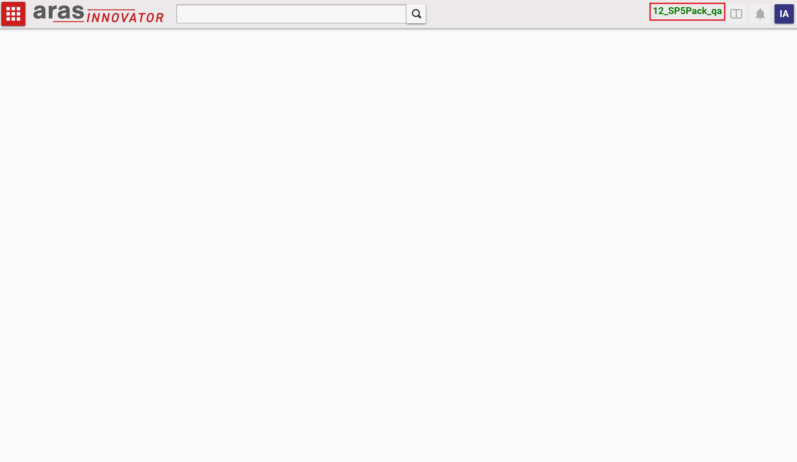
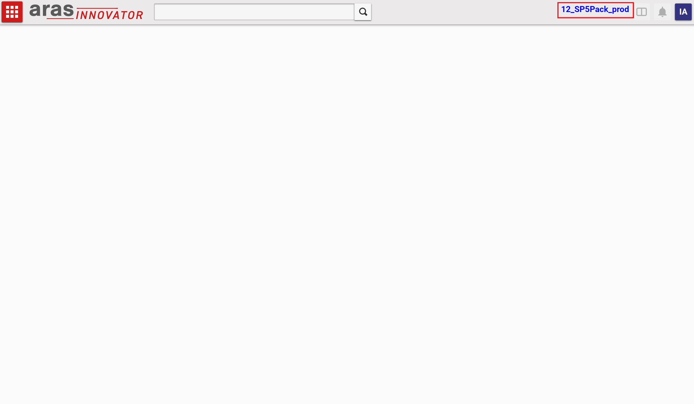

# Color Coded Database Headers
Uses CUI to add color coded database name to the header bar according to the database that is being accessed if the following is appended to the end of the name:

"_dev",
"_qa",
or "_prod"

## History

#### Supported Aras Versions

Project | Aras
--------|------
[v1.0.0](https://github.com/NithinMahesh1/color-coded-database-headers/releases/tag/v1.0.0) | 12.0 SP5

## Installation

#### Important!
**Always back up your code tree and database before applying an import package or code tree patch!**

### Pre-requisites
1. Aras Innovator installed
2. Aras Package Import tool
3. **aras.labs.cui.databaseNameInHeader** import package

### Install Steps

#### Database Installation
1. Backup your database and store the BAK file in a safe place.
2. Open up the Aras Package Import tool.
3. Enter your login credentials and click **Login**
  * _Note: You must login as root for the package import to succeed!_
4. Enter the package name in the TargetRelease field.
  * Optional: Enter a description in the Description field.
5. Enter the path to your local `..\Color Coded Database Headers\Imports\imports.mf` file in the Manifest File field.
6. Select both packages in the Available for Import field.
7. Select Type = **Merge** and Mode = **Thorough Mode**.
8. Click **Import** in the top left corner.
9. Close the Aras Package Import tool.

## Usage

1. Login as admin
	* This action will be hidden from non-adminsitrator users
2. Confirm that you can see the database name in the header bar

## Contributing

1. Fork it!
2. Create your feature branch: `git checkout -b my-new-feature`
3. Commit your changes: `git commit -am 'Add some feature'`
4. Push to the branch: `git push origin my-new-feature`
5. Submit a pull request

## Credits

Created by Nithin Mahesh for Aras Labs. @NithinMahesh1

## License

Published to Github under the MIT license. See the [LICENSE file](./LICENSE.md) for license rights and limitations.